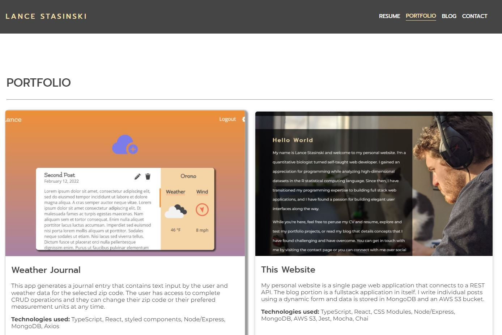

# Website-server

REST API for my personal website, weather journal app, travel app, and text-sentiment analysis app, and a server for the views of my portfolio apps.

## Table of Contents

- [Introduction](#Introduction)
- [Links](#Links)
- [Screenshot](#Screenshot)
- [Highlights](#Highlights)
- [Functions](#Functions)
- [Prerequisites](#Prerequisites)
- [Scripts](#Scripts)
- [Challenges](#Alternatives)
- [Ideas](#Ideas)
- [License](#License)
- [Acknowledgements](#Acknowledgements)

## Introduction

This Express server primarily functions as a REST API for my personal website. It manages GET, POST, PATCH, and DELETE requests for my blog and comment section, and it retrieves data from a MongoDB Atlas database and an AWS S3 bucket. The server also functions as a REST API for my weather journal app, travel app, and text-sentiment analysis app portfolio projects. Lastly, it serves static views for each of my portfolio sites.

## Links

Github:

- server - [https://github.com/LanceStasinski/Website-server](https://github.com/LanceStasinski/Website-server)
- website client - [https://github.com/LanceStasinski/Website-client](https://github.com/LanceStasinski/Website-client)
- weather journal - [https://github.com/LanceStasinski/FEND-03-WeatherJournalApp-React](https://github.com/LanceStasinski/FEND-03-WeatherJournalApp-React)
- travel app - [https://github.com/LanceStasinski/FEND-05-TravelApp](https://github.com/LanceStasinski/FEND-05-TravelApp)
- text sentiment analysis - [https://github.com/LanceStasinski/FEND-04-EvaluateNewsApp](https://github.com/LanceStasinski/FEND-04-EvaluateNewsApp)
- landing page project - [https://github.com/LanceStasinski/FEND-02-LandingPage](https://github.com/LanceStasinski/FEND-02-LandingPage)
- blog project - [https://github.com/LanceStasinski/FEND-01-BlogPost](https://github.com/LanceStasinski/FEND-01-BlogPost)

Deployed at [https://www.lancestasinski.com](https://www.lancestasinski.com)

## Screenshot

## Highlights

- Converts received blog post data from JSON to arrays to be stored in a MongoDB Atlas database
- Handles GET, POST, PATCH, and DELETE requests from the apps that it serves
- Sends requested links to items (pdfs, videos, and images) stored in AWS S3 to the client
- Sends image files to AWS S3 when a post is created, if it contains such files
- Uses mongoose to handle CRUD operations in the MongoDB database
- Validates user input with express-validator and custom logic
- Sends json web tokens to the client for authenticated users and those tokens are used for authorization for sensitive requests
- Updates the comment section of each post in real time using websockets
- Connects to external APIs for weather data, geographic data, and for natural language processing
- Uses SendGrid to send custom emails to me when a user fills out my contact form or adds a comment
- Serves portfolio projects statically
- Serves my HTML/CSS Blog project using specific GET routes

## Functions

- Create, Read, Update, and Delete blog posts
- Statically serve portfolio projects and act as a REST API for them
- Store and retrieve data from AWS S3 and MongoDB

## Challenges

The most challenging aspect of this project was finding out how to update and delete blog posts which could have data stored in both AWS S3 and MongoDB. It was also difficult to delete comments from both Blog and User collections in MongoDB. Connecting with the AWS S3 bucket came with challenges as well due to rather cryptic documentation from AWS.

## Prerequisites

This project was built on a Windows OS with the following tools installed:

- git version 2.31.1.windows.1
- yarn v1.22.10
- NodeJS v16.13.1

## Scripts

- `yarn install` will install this project's dependencies
- `yarn build` will compile TypeScript to JavaScript for production
- `yarn start-dev` will start a development server for this project using nodemon
- `yarn test` will run tests with Mocha and Chai - NOTE: More unit tests will be added soon

## Alternatives

The portfolio projects could be served and deployed independently, but the current method seemed appropriate for managing the projects all in one place.

## Ideas

Using NextJS may have SEO optimization improvements by adding server side rendering to the React pages of the website.

## License

This project is licensed under the GNU GPLv3 License - [https://www.gnu.org/licenses/quick-guide-gplv3.html](https://www.gnu.org/licenses/quick-guide-gplv3.html)

## Acknowledgements

- [TypeScript](https://www.typescriptlang.org/) for helping me reduce TypeErrors and for IDE support
- [Udemy](https://www.udemy.com/course/nodejs-the-complete-guide/) with special thanks to Maximilian Schwarzmuller for teaching me how to use Node
